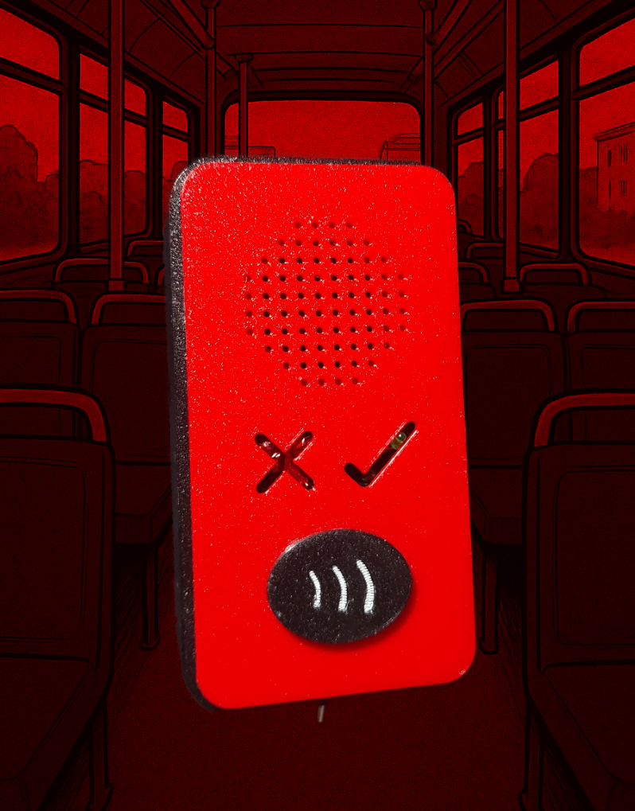
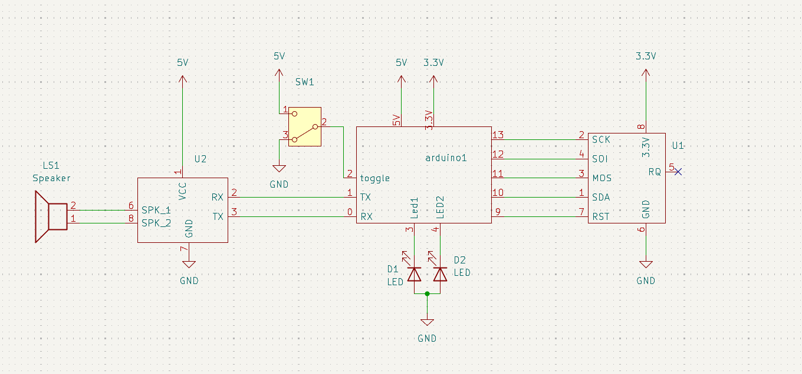

# totemDeEvasion

proyecto diseñado y fabricado por santiagoClifford en el marco de Halloween 2025. Consiste en la personificación de un ente imaginario, que representa el proceso de pagar el pasaje al subirse a las micros del sistema red.

## especificaciones

### Bill of Materials

|  | nombre | cantidad | lin compra | precio unidad(CLP) | precio item |
|---|---|---|---|---|---|
| interruptor | MTS-102 | 1 | https://afel.cl/products/interruptor-mts-102-3-pines | $400 | $400 |
| parlante | Mini Parlante Altavoz | 1 | https://afel.cl/products/mini-parlante-altavoz-de-3w | $3.000 | $3.000 |
| modulo mp3 | DFPlayer mini | 1 | https://afel.cl/products/modulo-reproductor-mp3-dfplayer-mini | $2.990 | $2.990 |
| micro sd | micro SD 16gb  | 1 | https://lapizlopez.cl/product/tarjeta-micro-sd-16gb-sdhc-cl10/ | $5.990 | $5.990 |
| lector NFC | RFID RC522 | 1 | https://afel.cl/products/lector-rfid-rc522 | $3.990 | $3.990 |
| mini broto | Mini protoboard | 1 | https://afel.cl/products/mini-protoboard-170-puntos | $990 | $990 |
| placa arduino compatible (yo usé UNO R4 Mínima) | Arduino Nano V3.0 CH340 | 1 | https://hubot.cl/producto/arduino-nano-atmega168-3-0v/ | $4.900 | $4.900 |
| cable alimentación | tipo-C a tipo-C | 1 | https://hubot.cl/producto/cable-tipo-c-a-tipo-c-para-carga-y-transmision-de-datos-30-cm-sku-4097/ | $990 | $990 |
| cables | Macho-Hembra | 1 | https://afel.cl/products/pack-20-cables-de-conexion-macho-hembra | $1.000 | $1.000 |
| cables | cable unifiliar | 20cm | https://mcielectronics.cl/shop/product/cable-para-protoboard-gris-sparkfun-10446 | $4.990 | $132 |
| led rojo | diodo led 5mm  | 2 | https://afel.cl/products/diodo-led-5mm-ultrabrillante-rojo | $70 | $140 |
| led verde | diodo led 5mm | 2 | https://afel.cl/products/diodo-led-5mm-ultrabrillante-verde?_pos=17&_sid=8cc70765c&_ss=r | $70 | $140 |
| filamento rojo | petg artillery | 25g | https://afel.cl/products/filamento-petg-rojo-artillery-1-75mm-1kg | $10.000 | $250 |
| filamento negro | pet-g artillery | 85g | https://afel.cl/products/filamento-petg-negro-artillery-1-75mm-1kg | $10.000 | $850 |
| cautín | MK0376 | 1 | https://www.mercadolibre.cl/cautin-tipo-lapiz-para-soldar-40-watts-makawa-mk-0376/p/MLC24329921 | $3.200 | $3.200 |
| estaño | Rollo soldadura | 2g | https://mcielectronics.cl/shop/product/rollo-soldadura-de-estano-1-0mm-30g/ | $3.000 | $200 |
| resistencias | 1k | 4 |  |  |  |
| resistencias | 10k | 1 |  |  |  |
| TOTAL |  |  |  |  |  |

### piezas impresas en 3D

| pieza | color | gramos |
|---|---|---|
| face | rojo | 24g |
| sostenNfc | rojo | 0.4g |
| midBod | negro | 50g |
| back | negro | 22g |
| spkrCap | negro | 6.2g |
| nfcCap | negro | 3g |
| lamp | negro | 2g |
| total | 2, 5 | 25g, 85g |

### cableado

esquemático hecho en kicad. Los símbolos del módulo MP3, del lector NFC y del arduino fueron hechos por mí, usando la herramienta de edición de símbolos de kicad.
