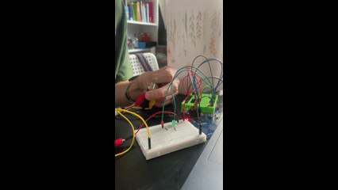
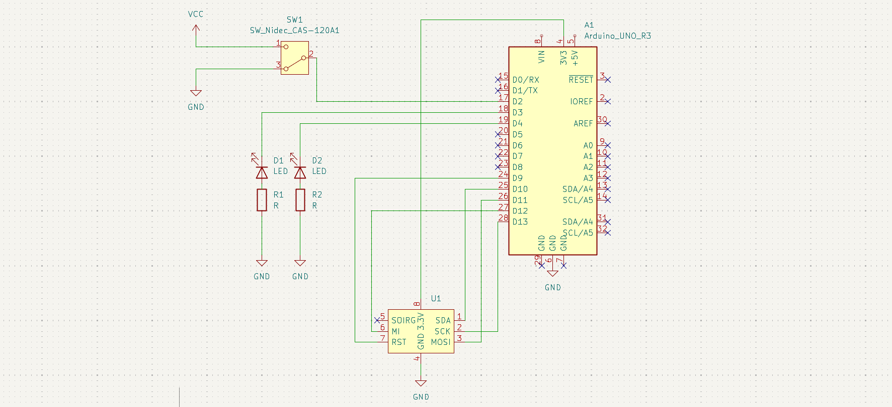
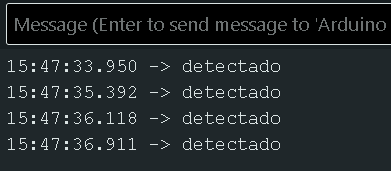
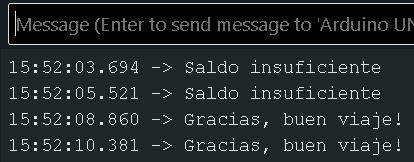

# fabricación robot y unión de partes

## proceso

este paso, viene después de entender el funcionaiento, por separado, del sensor nfc, y el toggle. 



armé el circuito para que, cuanod se sense un nfc, se mande un output de una LED, este output varía según el estado del toggle.



ahí se ve un esquemático de cómo se ve hasta ahora.


## rfid

### sensor nfc

<https://naylampmechatronics.com/blog/22_tutorial-modulo-lector-rfid-rc522.html>

con ese tutorial, pude detectar las ID de los nfc, y lo reduje para que imprima en el puerto serial "detectado" cada vez que sensa un nfc.

```cpp
#include <SPI.h>
#include <MFRC522.h>

#define RST_PIN 9
#define SS_PIN 10
MFRC522 mfrc522(SS_PIN, RST_PIN);

void setup() {
  Serial.begin(9600);
  SPI.begin();
  mfrc522.PCD_Init();
}

void loop() {
  if (mfrc522.PICC_IsNewCardPresent() && mfrc522.PICC_ReadCardSerial()) {
    Serial.println("detectado");
    mfrc522.PICC_HaltA();
  } 
}
```



## módulo mp3

### MP3-TF-1GP

[datasheet](https://www.alldatasheet.es/html-pdf/2032297/AGELECTRONICA/MP3-TF-16P/1185/1/MP3-TF-16P.html)


<https://www.build-electronic-circuits.com/arduino-speaker>


este módulo acpeta tarjeta micro SD de 32gb o menos. 

solo poseo una micro SD de 64Gb, compré una [Adata Premier microSDHC](https://www.myshop.cl/producto/memoria-flash-32-gb-adata-premier-microsdxcsdhc-uhs-i-class10-ausdh32guicl10a1-ra1-p38615)

cuando intenté colocar los archivos, windows me indicaba que la tarjeta tiene protección contra escritura. Finalmente pude resolverlo usando el command prompt con [este tutorial](https://www.youtube.com/watch?v=uPSLwj0JEJI)

Los sonidos lo extraje de videos de youtube. 

el sonido que suena cuando pagas el pasaje lo saqué de [este reportaje](https://youtu.be/WrMJ976EuA4?si=CqZEK9t-8fkpy0fj)

el sonido que suena cuando el saldo es insuficiente lo saqué de [este youtube short](https://youtu.be/vTpdEQijg0s?si=Jww4EK1SQI2xIPfD)

depués de muchos intentos fallidos, leí que con tarjetas microSD de 32gygabytes era poco estable, asi que me robé la microSD del celular de mi awela, y le puse la que había comprado de 32GB.

logre que funcionara con [este tutorial](https://wiki.dfrobot.com/DFPlayer_Mini_SKU_DFR0299#Connection_Diagram)


## interruptor

####### código

estas son las líneas de código necesarias para que el estado del toggle defina el output.

```cpp
int togglePin;

void setup(){
  pinMode(togglePin, INPUT);
}

void loop(){
    if (state == HIGH) {
      Serial.println("Switch ON → approved!");
    } else {
      Serial.println("Switch OFF → denied!");
    }

}
  ```

con el código anterior el puerto serial muestra lo siguiente:



##### pinout

El cableado del toggle, es el común a un pin digital, y los pines de los lados uno a GND y otro a 5V.