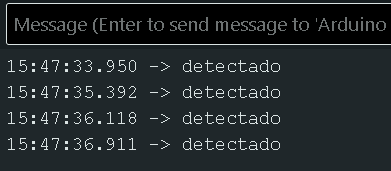

# rfid

## sensor nfc

<https://naylampmechatronics.com/blog/22_tutorial-modulo-lector-rfid-rc522.html>

con ese tutorial, pude detectar las ID de los nfc, y lo reduje para que imprima en el puerto serial "detectado" cada vez que sensa un nfc.

```cpp
#include <SPI.h>
#include <MFRC522.h>

#define RST_PIN 9
#define SS_PIN 10
MFRC522 mfrc522(SS_PIN, RST_PIN);

void setup() {
  Serial.begin(9600);
  SPI.begin();
  mfrc522.PCD_Init();
}

void loop() {
  if (mfrc522.PICC_IsNewCardPresent() && mfrc522.PICC_ReadCardSerial()) {
    Serial.println("detectado");
    mfrc522.PICC_HaltA();
  } 
}
```

