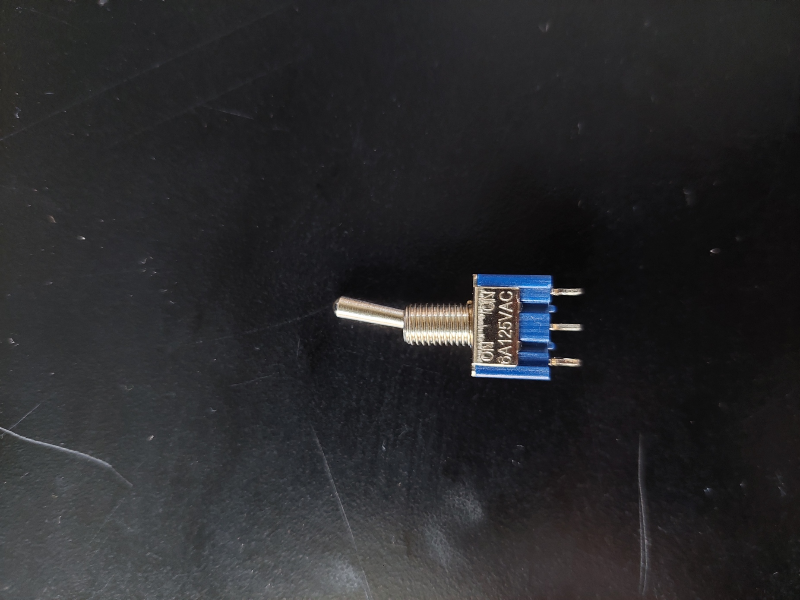
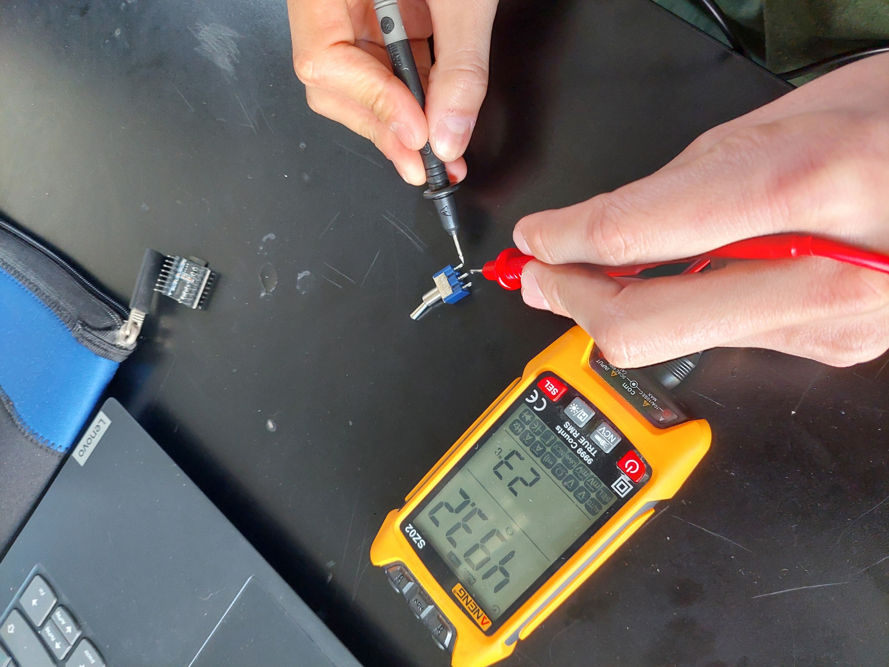
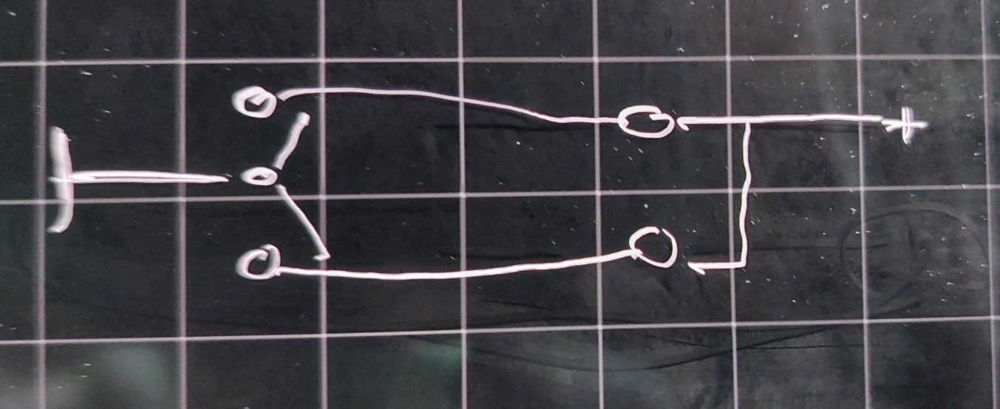
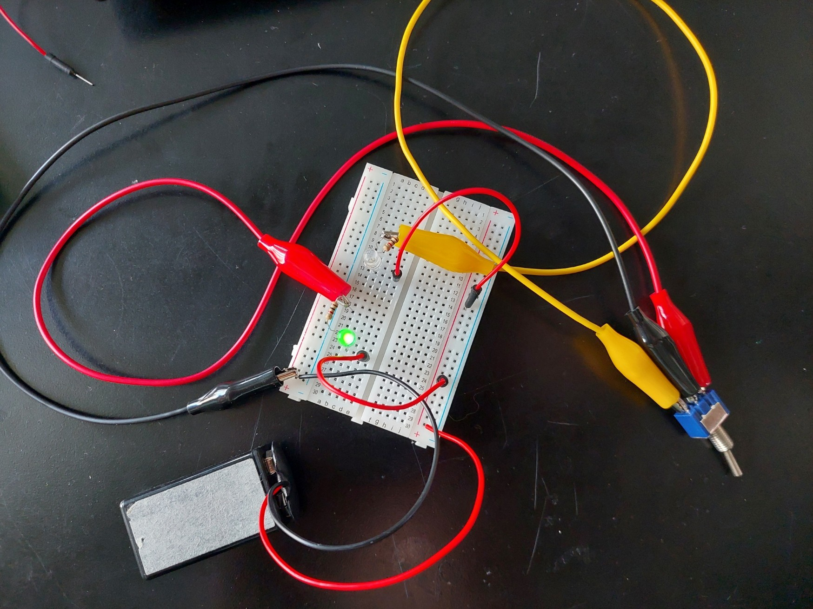
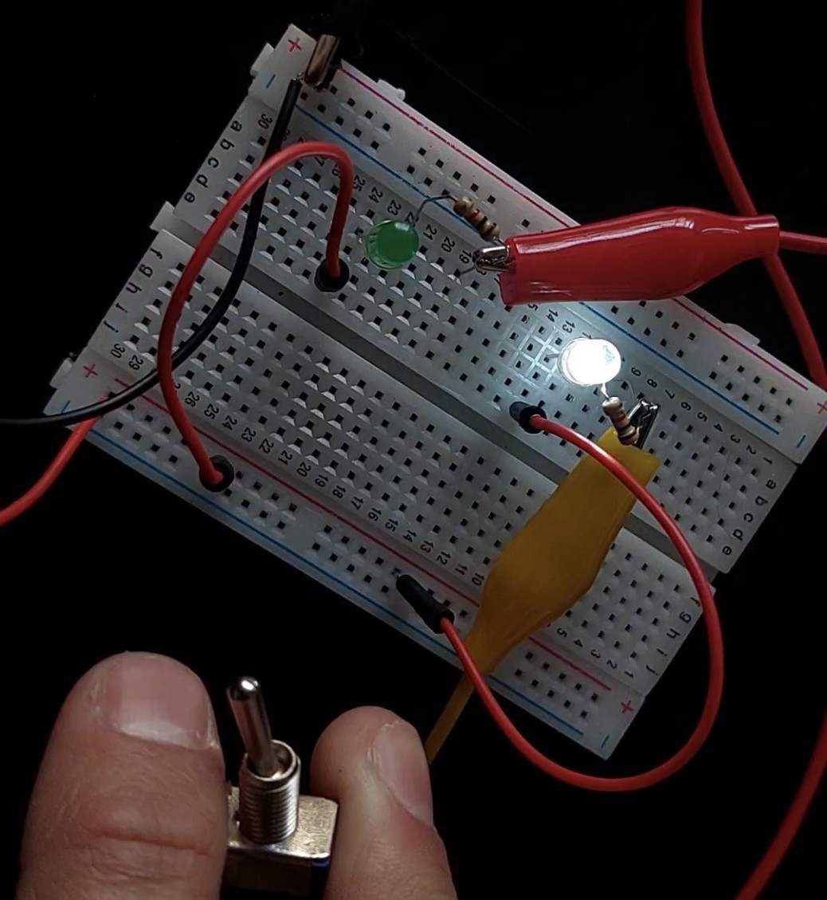
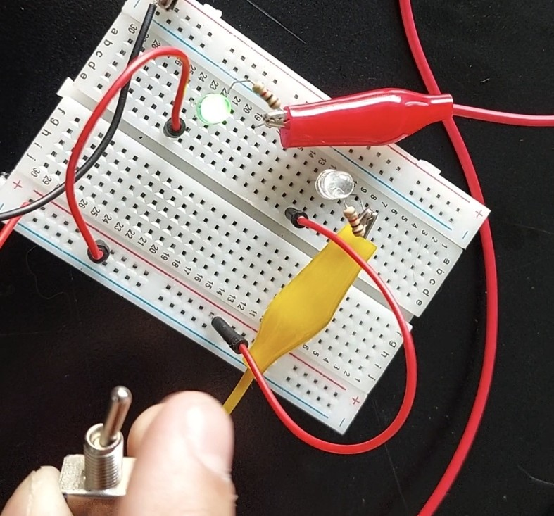

# toggle switch

<https://youtu.be/0ZXYRU9KPG8>

## tipos de toggle

- [Tipos de toggle](https://uk.rs-online.com/web/content/discovery/ideas-and-advice/toggle-switches-guide)

### on-on

controlan 2 dispositivos, ambos estados prenden uno de ellos y apagan el otro.

### on-off

tienen 3 pines, 2 estados. 

## proceso



este componente es un [MTS102](https://www.alldatasheet.es/datasheet-pdf/pdf/941859/MOTOROLA/MTS102.html)

primero, comencé con un circuito electrónico, en el cual, un interruptor controla cuál led se enciende. Sin código.



con un tester, comprobé cual es el pin común: el del medio.





con este circuito, se puede ir alternando entre los leds con el interruptor.




### código

estas son las líneas de código necesarias para que el estado del toggle defina el output.

```cpp
int togglePin;

void setup(){
  pinMode(togglePin, INPUT);
}

void loop(){
    if (state == HIGH) {
      Serial.println("Switch ON → approved!");
    } else {
      Serial.println("Switch OFF → denied!");
    }

}
  ```

con el código anterior el puerto serial muestra lo siguiente:


#### pinout

El cableado del toggle, es el común a un pin digital, y los pines de los lados uno a GND y otro a 5V.